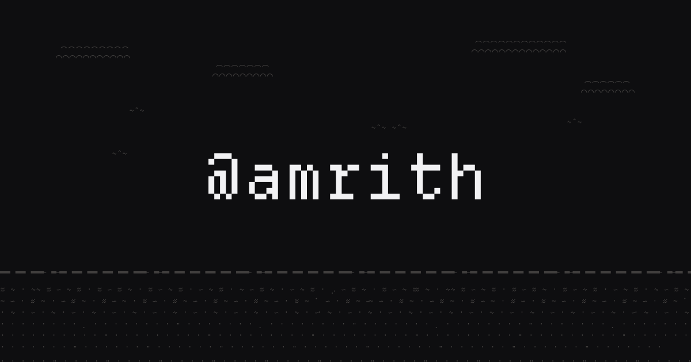

<h1>Amrith Shanbhag</h1>

<em>I spent a decade growing communities for consumer startups including Product Hunt. Now I build my own products.</em>

  <a href="https://amrith.co">amrith.co</a>
  &nbsp;·&nbsp; <a href="https://x.com/amrith">X</a>
  &nbsp;·&nbsp; <a href="https://github.com/htirma">GitHub</a>
  &nbsp;·&nbsp; <a href="https://www.linkedin.com/in/amriths">LinkedIn</a>

---

The source for **[amrith.co](https://amrith.co)**: a single, restrained page. Vanilla HTML and CSS, no build step, no dependencies, hosted on GitHub Pages.

## Building now

- **[Timebase](https://timebase.me)**: timezones made simple. A calmer way to visualize and plan across time zones.
- **[Shio](https://shio.sh)**: your agents, in your pocket. The terminal for the agent era.
- **[Dhuni](https://dhuni.net)**: a quiet listening world. 24/7 internet radio for Indian classical, based on the seasons.
- **[Stem](https://stem.md)**: follow your curiosity. Document your rabbit holes and wander into everyone else's.
- **[Medivalent](https://medivalent.com)**: a pharmacy guide across borders. Find the medicine you need, by brand or symptom, in 16 countries.
- **[Samooh](https://samooh.com)**: the long game. A community for Indian-origin founders building global products.

## Past lives

[Product Hunt](https://producthunt.com/@amrith) (community team to Head of Social; grew Twitter from 200K to 400K+, organic), Opal, Stoic, Envision, Feathrd, and others.

## Working together

Building something in consumer? I'm always happy to [talk](mailto:hi@amrith.co). Being the bridge between the team and the people they build for, getting them to care about what we create, is what I do best.

---

Built for the love of the game.

